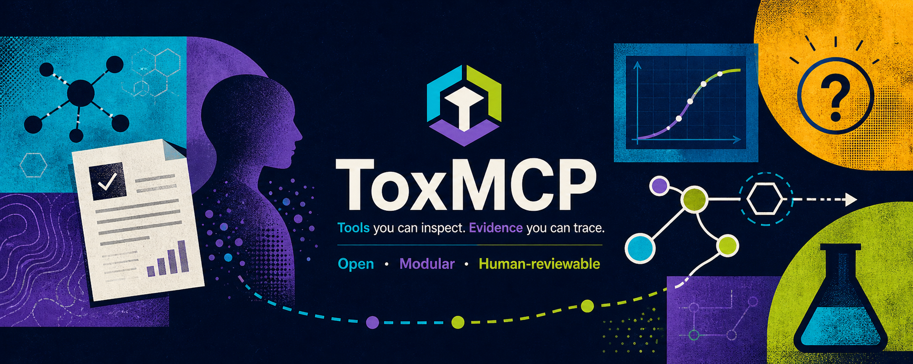

  

# ToxMCP

**Open toxicology tools for AI assistants, built so people can inspect the evidence, trace the sources, and see the uncertainty.**

Each module uses the [Model Context Protocol](https://modelcontextprotocol.io/) (MCP), an open standard that lets compatible AI assistants call external tools. Use one module on its own, connect several into a workflow, or explore the code and evidence without an AI assistant.

## Start exploring

1. **[Browse the suite guide](https://github.com/ToxMCP/toxmcp)** to understand the tools and choose a starting point.
2. **[Start with CompTox](https://github.com/ToxMCP/comptox-mcp)** for source-linked chemical identity and screening evidence from the U.S. Environmental Protection Agency.
3. **[Read the preprint](https://doi.org/10.64898/2026.02.06.703989)** for the scientific background.

## Find your tool

| If you want to explore… | Start here |
| --- | --- |
| Chemical identity and screening evidence | [CompTox MCP](https://github.com/ToxMCP/comptox-mcp) |
| Exposure scenarios | [Direct-Use Exposure MCP](https://github.com/ToxMCP/direct-use-exposure-mcp) |
| Environmental fate | [Environmental Fate MCP](https://github.com/ToxMCP/environmental-fate-mcp) |
| Kinetics and internal dose | [Physiologically Based Pharmacokinetic (PBPK) MCP](https://github.com/ToxMCP/pbpk-mcp) |
| Mechanistic pathways | [Adverse Outcome Pathway (AOP) MCP](https://github.com/ToxMCP/aop-mcp) |
| Chemical grouping and read-across | [OECD QSAR Toolbox MCP](https://github.com/ToxMCP/oqt-mcp), for quantitative structure–activity relationships |
| Rapid screening of absorption, distribution, metabolism, excretion, and toxicity | [ADMETlab MCP](https://github.com/ToxMCP/admetlab-mcp) |

## What makes ToxMCP useful

- **Evidence you can trace:** results keep source links and provenance close at hand.
- **Boundaries you can see:** assumptions, limitations, and uncertainty stay visible.
- **Pieces you can combine:** structured results can move between compatible tools.
- **People stay in control:** screening evidence remains clearly separated from stronger scientific conclusions.

## A quick reality check

These tools support research and screening. A runnable model or returned result is not automatically scientifically qualified, clinically appropriate, or ready for a regulatory decision. Review important outputs independently and follow each upstream data provider's access, rate-limit, license, and attribution terms.

## Build with us

Contributions are welcome. Start with the repository that owns the tool you want to improve and read its local guidance. Organization-wide defaults are available in our [contributing guide](../CONTRIBUTING.md) and [security policy](../SECURITY.md).

ToxMCP was developed in part through the [VHP4Safety](https://github.com/VHP4Safety) project and related computational-toxicology research. Funding included the Dutch Research Council (NWO), grant `NWA.1292.19.272`.
